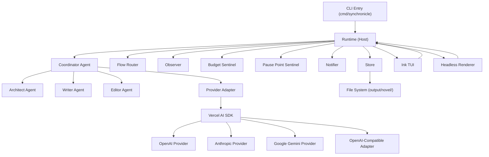

# Node.js Runtime Migration Design

Feature Name: nodejs-runtime-migration
Updated: 2026-07-12

## Description

将 SynChronicle 从 Go 1.25 + Bubble Tea + agentcore/litellm + GoReleaser/Docker 运行时一次性迁移到 Node.js 24 LTS + TypeScript + Ink/React + Vercel AI SDK + pnpm/npm 发布。保留全部功能等价、配置兼容和数据兼容，移除 Docker 运行和部署。

## Architecture



迁移核心原则：

1. **功能等价优先**：每个 Go 模块在 TypeScript 中找到等价实现，不做功能裁剪或简化。
2. **数据格式不变**：`output/novel/` 下的所有 JSON/JSONL/MD 文件格式保持不变，Go 版本创建的小说可被 Node.js 版本直接读取和继续。
3. **配置格式不变**：`config.json` 的 JSONC 格式和字段结构保持不变。
4. **CLI 参数不变**：所有 flag 和子命令保持不变。
5. **一次性替换**：完整实现 TypeScript 版本并通过测试后，一次性删除全部 Go 源码和 Docker 配置。

## Components and Interfaces

### 1. CLI Entry (`src/cli/`)

**Responsibility:** 解析命令行参数，分发到 setup/version/update/run 子流程。

**Interfaces:**
- `parseArgs(argv: string[]): CliOptions` — 解析 `--config`、`--headless`、`--prompt`、`--prompt-file`、`--version`/`-v`/`version`、`update [version]`，校验互斥规则。
- `main(): Promise<void>` — 入口函数，按优先级分发。

**Mapping from Go:** `cmd/synchronicle/main.go` 的 `parseCLIOptions` 和 `runWithConfig`。

### 2. Config (`src/config/`)

**Responsibility:** 加载、合并、校验 JSONC 配置。

**Interfaces:**
- `loadConfig(flagPath?: string): Promise<Config>` — 按优先级加载并合并配置。
- `needsSetup(flagPath?: string): Promise<boolean>` — 检查是否需要首次引导。
- `runSetup(): Promise<Config>` — 交互式引导创建配置。
- `saveConfig(path: string, cfg: Config): Promise<void>`
- `validateConfig(cfg: Config): void` — 校验 provider/model/providers/roles/budget/notify。
- `fillDefaults(cfg: Config): Config` — 填充默认值。
- `resolveContextWindow(cfg: Config, modelName: string): { window: number; source: ContextWindowSource }`
- `resolveReasoningEffort(cfg: Config, role: string): string`

**Zod Schemas:**
- `ProviderConfigSchema` — type/api/api_key/base_url/models/extra_body/extra
- `RoleConfigSchema` — provider/model/fallbacks/reasoning_effort
- `BudgetConfigSchema` — book_usd/warn_ratio/hard_stop
- `NotifyConfigSchema` — enabled/command/events
- `ConfigSchema` — provider/model/reasoning_effort/providers/roles/style/context_window/budget/notify

**Mapping from Go:** `internal/bootstrap/config.go`、`internal/bootstrap/configfile.go`、`internal/bootstrap/setup.go`、`internal/bootstrap/models.go`。

### 3. Provider Adapter (`src/providers/`)

**Responsibility:** 将现有配置格式映射到 Vercel AI SDK Provider 实例。

**Interfaces:**
- `createProvider(name: string, pc: ProviderConfig): LanguageModel` — 根据 type 或已知 provider 名创建 Vercel AI SDK Provider 实例。
- `createModelSet(cfg: Config): ModelSet` — 按角色创建可热切换的模型集合。
- `ModelSet.forRole(role: string): LanguageModel`
- `ModelSet.forRoleWithFailover(role: string, report: FailoverReporter): LanguageModel`
- `ModelSet.swap(role: string, provider: string, model: string): Promise<void>`
- `ModelSet.currentSelection(role: string): { provider: string; model: string; explicit: boolean }`

**Vercel AI SDK Integration:**
- OpenAI: `@ai-sdk/openai` 的 `createOpenAI({ apiKey, baseURL })`
- Anthropic: `@ai-sdk/anthropic` 的 `createAnthropic({ apiKey, baseURL })`
- Google Gemini: `@ai-sdk/google` 的 `createGoogleGenerativeAI({ apiKey, baseURL })`
- OpenAI-compatible: `createOpenAI({ apiKey, baseURL })`，兼容 OpenRouter/DeepSeek/Qwen/GLM/Grok/Ollama
- `extra_body` 透传通过 `providerOptions` 或自定义 fetch wrapper 注入请求体
- `extra` 透传通过自定义 fetch wrapper 注入 headers
- `api: "responses"` 使用 OpenAI Responses API 端点
- 流式输出使用 `streamText`，非流式使用 `generateText`
- 工具调用使用 `tools` 参数和 `tool` 函数

**Mapping from Go:** `internal/bootstrap/models.go` 的 `createModelFromConfig`、`ModelSet`、`SwappableModel`、`failoverModel`。

### 4. Domain Types (`src/domain/`)

**Responsibility:** 定义核心类型和 Zod Schema。

**Types:**
- `Novel`、`OutlineEntry`、`Character`、`VolumeOutline`、`ArcOutline`、`WorldRule`、`StoryCompass`
- `Progress`、`Phase`、`FlowState`、`PlanningTier`
- `Checkpoint`、`Scope`、`ScopeKind`
- `RuntimeEvent`、`Review`、`Simulation`
- `Usage`、`WritingStats`
- `Cast`、`Tracking`、`Transitions`

**Mapping from Go:** `internal/domain/` 全部文件，每个 Go struct 转为 TypeScript interface + Zod schema。

### 5. Store (`src/store/`)

**Responsibility:** 文件系统持久化，原子写入，数据校验。

**Interfaces:**
- `Store` — 组合根，持有所有子存储
- `Store.init(): Promise<void>` — 创建目录结构
- `Store.checkConsistency(): string[]` — 浅层一致性校验
- `Store.foundationMissing(): string[]` — 基础设定缺项检查
- 子存储：`ProgressStore`、`OutlineStore`、`DraftStore`、`SummaryStore`、`RunMetaStore`、`UserRulesStore`、`SignalStore`、`RuntimeStore`、`CharacterStore`、`CastStore`、`WorldStore`、`CheckpointStore`、`SessionStore`、`UsageStore`、`SimulationStore`

**Atomic Write Strategy:** 写入临时文件后原子 rename（`fs.rename`），确保中断安全。对需要跨域原子操作的场景使用文件锁。

**Mapping from Go:** `internal/store/` 全部文件。

### 6. Tools (`src/tools/`)

**Responsibility:** 创作工具实现，每个工具对应一个 Vercel AI SDK tool。

**Tools:**
- `novel_context` — 获取当前状态和创作上下文
- `save_foundation` — 保存前提/大纲/角色/世界规则
- `plan_chapter` — 规划章节
- `draft_chapter` — 写入草稿
- `edit_chapter` — 编辑已有章节
- `check_consistency` — 一致性检查
- `commit_chapter` — 提交终稿
- `read_chapter` — 读取章节正文
- `save_review` — 保存评审结果
- `save_arc_summary` — 保存弧摘要
- `save_volume_summary` — 保存卷摘要
- `save_pause_point` — 保存停靠点
- `save_user_rules` — 保存用户规则
- `ask_user` — 向用户提问
- `reopen_book` — 重开完结小说

**Each tool:**
- 定义 Zod 参数 schema
- 执行业务逻辑
- 原子落盘
- 追加 checkpoint
- 返回结构化结果

**Mapping from Go:** `internal/tools/` 全部文件。

### 7. Agents (`src/agents/`)

**Responsibility:** 构建 Coordinator 和子代理，注册工具和提示词。

**Interfaces:**
- `buildCoordinator(cfg, store, models, bundle, recordUsage, onFlowBoundary, onGuardBlock): { coordinator, askUser, writerRestore, coordinatorCtxMgr, applyThinking }`
- 子代理通过 `spawnSubAgent` 创建，各自注册独立系统提示词和工具集
- `ContextManager` 管理上下文窗口、压缩和摘要

**Context Engine:** 使用 token 计数器（`gpt-tokenizer` 或 Vercel AI SDK 的 token 估算）实现上下文压缩。压缩阈值：`window * 0.85`，最小保留：`max(8000, window * 0.15)`。

**Mapping from Go:** `internal/agents/build.go`、`internal/agents/context_manager.go`、`internal/agents/ctxpack/`。

### 8. Runtime / Host (`src/runtime/`)

**Responsibility:** 生命周期管理、恢复、事件、干预注入。

**Interfaces:**
- `Host.new(cfg, bundle): Promise<Host>`
- `Host.startPrepared(prompt: string): Promise<void>`
- `Host.resume(): Promise<{ label: string | null; error?: Error }>`
- `Host.continue(prompt: string): Promise<void>`
- `Host.abort(reason: string, level: string): void`
- `Host.close(): void`
- `Host.events(): AsyncIterable<Event>`
- `Host.stream(): AsyncIterable<string>`
- `Host.snapshot(): UISnapshot`
- `Host.askUser(): AskUserTool`
- `Host.replayQueue(maxItems: number): Promise<RuntimeItem[]>`

**Flow Router:** `src/runtime/flow/router.ts` 的 `route(state: State): Instruction | null`，纯函数实现，与 Go 版本逻辑完全一致。

**Budget Sentinel:** `src/runtime/budget.ts`，订阅子代理边界事件执行停机。

**Pause Point Sentinel:** `src/runtime/pause.ts`，执行用户预约的停靠点暂停。

**Mapping from Go:** `internal/host/host.go`、`internal/host/resume.go`、`internal/host/events.go`、`internal/host/flow/`、`internal/host/budget.go`、`internal/host/pause.go`、`internal/host/observer.go`、`internal/host/usage.go`。

### 9. TUI (`src/tui/`)

**Responsibility:** Ink + React 终端交互界面。

**Components:**
- `App` — 根组件，管理页面路由
- `StartupScreen` — 欢迎页和启动模式选择
- `Workbench` — 创作工作台主界面
- `Sidebar` — Agent 状态面板
- `ActivityPanel` — 事件流和输出面板
- `OutlinePanel` — 大纲和章节面板
- `InputBar` — 用户干预输入
- `CommandPalette` — `/model`、`/diag`、`export`、`import` 等命令
- `ModalFrame` — 模态框框架

**State Management:** 使用 React 的 `useReducer` 或 zustand 管理 TUI 状态，通过 Host 事件流驱动更新。

**Mapping from Go:** `internal/entry/tui/` 全部文件。

### 10. Headless (`src/headless/`)

**Responsibility:** 无界面运行，消费事件流并输出到 stdout/stderr。

**Interfaces:**
- `run(cfg: Config, bundle: Bundle, opts: Options): Promise<void>`

**Mapping from Go:** `internal/entry/headless/`。

### 11. Assets (`src/assets/`)

**Responsibility:** 加载提示词、参考文档和风格模板。

**Strategy:** Node.js 版本使用 `fs.readFileSync` 从 `assets/` 目录读取 Markdown 文件，替代 Go 的 `embed`。运行时缓存加载结果。

**Mapping from Go:** `assets/load.go` 和 `//go:embed` 指令。

### 12. Version & Update (`src/version/`)

**Responsibility:** 版本信息和 npm 自更新。

**Interfaces:**
- `printVersion(stdout: WritableStream, info: VersionInfo): void`
- `update(opts: UpdateOptions): Promise<UpdateResult>`

**Update Strategy:** 检查 npm 注册表最新版本，执行 `npm install -g synchronicle@<version>`。Windows 支持 npm 更新（替代 Go 版本不支持 Windows 自更新的限制）。

**Mapping from Go:** `internal/version/info.go`、`internal/version/update.go`。

### 13. Notify (`src/notify/`)

**Responsibility:** 无人值守告警通道。

**Interfaces:**
- `Notifier.new(command: string, events: string[]): Notifier`
- `Notifier.send(notification: Notification): void` — 异步发送

**Mapping from Go:** `internal/notify/notify.go`。

### 14. Rules (`src/rules/`)

**Responsibility:** 用户规则加载、归一化和快照。

**Interfaces:**
- `loadRules(store: Store): Promise<Snapshot>`
- `normalizeRules(raw: RawRules, model: LanguageModel): Promise<NormalizedRules>`
- `checkRules(snapshot: Snapshot): LintResult[]`

**Mapping from Go:** `internal/rules/`、`internal/userrules/`。

### 15. Evaluation (`src/eval/`)

**Responsibility:** 评测用例加载和执行。

**Interfaces:**
- `evalCommand(argv: string[]): number`
- `runEval(case: EvalCase): Promise<EvalResult>`
- `collectCases(dir: string): EvalCase[]`
- `gradeResult(result: EvalResult): Grade`
- `generateReport(results: EvalResult[]): Report`

**Mapping from Go:** `internal/eval/`。

### 16. Diagnostics (`src/diag/`)

**Responsibility:** 脱敏诊断导出。

**Interfaces:**
- `exportDiag(store: Store): Promise<string>`
- `redact(text: string): string`

**Mapping from Go:** `internal/diag/`。

### 17. Import & Simulation (`src/host/imp/`, `src/host/sim/`)

**Responsibility:** 导入已有文本和仿真创作。

**Mapping from Go:** `internal/host/imp/`、`internal/host/sim/`。

### 18. Export (`src/host/exp/`)

**Responsibility:** 导出为 txt 和 epub。

**Mapping from Go:** `internal/host/exp/`。

## Data Models

### Config (Zod Schema)

```typescript
const ProviderConfigSchema = z.object({
  type: z.string().optional(),
  api: z.enum(["chat", "responses"]).optional(),
  api_key: z.string().optional(),
  base_url: z.string().optional(),
  models: z.array(z.string()).optional(),
  extra_body: z.record(z.any()).optional(),
  extra: z.record(z.any()).optional(),
});

const RoleConfigSchema = z.object({
  provider: z.string(),
  model: z.string(),
  fallbacks: z.array(z.object({
    provider: z.string(),
    model: z.string(),
  })).optional(),
  reasoning_effort: z.string().optional(),
});

const ConfigSchema = z.object({
  provider: z.string(),
  model: z.string(),
  reasoning_effort: z.string().optional(),
  providers: z.record(ProviderConfigSchema).optional(),
  roles: z.record(RoleConfigSchema).optional(),
  style: z.string().optional(),
  context_window: z.number().optional(),
  budget: z.object({
    book_usd: z.number().optional(),
    warn_ratio: z.number().optional(),
    hard_stop: z.boolean().optional(),
  }).optional(),
  notify: z.object({
    enabled: z.boolean().optional(),
    command: z.string().optional(),
    events: z.array(z.string()).optional(),
  }).optional(),
});
```

### Progress

```typescript
const ProgressSchema = z.object({
  novel_name: z.string(),
  phase: z.enum(["init", "premise", "outline", "writing", "complete"]),
  current_chapter: z.number(),
  total_chapters: z.number(),
  completed_chapters: z.array(z.number()),
  total_word_count: z.number(),
  chapter_word_counts: z.record(z.number()).optional(),
  in_progress_chapter: z.number().optional(),
  completed_scenes: z.array(z.number()).optional(),
  flow: z.enum(["writing", "reviewing", "rewriting", "polishing", "steering"]).optional(),
  pending_rewrites: z.array(z.number()).optional(),
  rewrite_reason: z.string().optional(),
  strand_history: z.array(z.string()).optional(),
  hook_history: z.array(z.string()).optional(),
  current_volume: z.number().optional(),
  current_arc: z.number().optional(),
  layered: z.boolean().optional(),
  reopened_from_complete: z.boolean().optional(),
});
```

### Checkpoint

```typescript
const CheckpointSchema = z.object({
  seq: z.number(),
  scope: z.object({
    kind: z.enum(["chapter", "arc", "volume", "global"]),
    chapter: z.number().optional(),
    volume: z.number().optional(),
    arc: z.number().optional(),
  }),
  tool: z.string(),
  // ... additional fields from Go struct
});
```

## Correctness Properties

1. **Data Compatibility Invariant:** Node.js 版本读取的任何 Go 版本创建的数据文件，必须能完整解析并通过 Zod 校验，写回格式保持一致。
2. **Checkpoint Integrity:** 每个工具成功完成后的 checkpoint 必须持久化到 JSONL，恢复时从最后一条完整 checkpoint 继续。
3. **Flow Router Determinism:** 给定相同 State 输入，Route 必须返回与 Go 版本完全相同的 Instruction。
4. **CLI Compatibility:** 所有现有 CLI 参数和互斥规则必须保持不变。
5. **Config Compatibility:** 现有 `config.example.jsonc` 必须能被 Node.js 版本完整加载和校验。
6. **No Go Remnant:** 迁移完成后仓库中不得包含任何 `.go` 文件、`go.mod`、`go.sum`、Dockerfile 或 Go CI 工作流。
7. **No Docker:** 迁移完成后仓库中不得包含 Docker 运行或部署配置。

## Error Handling

1. **Config Errors:** 校验失败时输出明确错误信息到 stderr 并退出（非 headless 模式下暂停等待回车）。
2. **Provider Errors:** LLM 调用失败时按 retry 策略重试（指数退避，最多 7 次），重试耗尽后按 Failover 列表切换。
3. **Store Errors:** 文件读写失败时输出错误信息并中止当前操作，不损坏已有数据。
4. **Checkpoint Errors:** checkpoint 写入失败时中止当前工具执行，保持已有数据完整。
5. **TUI Errors:** 渲染错误捕获并显示错误面板，不崩溃进程。
6. **Process Exit:** 使用 `AbortController` 统一处理进程退出信号，确保正在进行的写入完成。

## Test Strategy

### Unit Tests
- Config 加载、合并、校验、默认值填充
- Store 读写、原子写入、一致性校验
- Flow Router 纯函数决策表
- Provider Adapter 创建和 Failover
- Tools 参数校验和业务逻辑
- Domain Zod schema 校验
- Version 检查和更新
- Notify 通道过滤和发送

### Integration Tests
- Host 启动、恢复、继续、中止生命周期
- Coordinator + 子代理协作流程
- Store 与 Tools 端到端写入
- Provider Adapter 与 Vercel AI SDK（使用 mock provider）

### Compatibility Tests
- 使用 Go 版本生成的 fixture 数据验证 Node.js 版本读取
- 验证写回的数据格式与 Go 版本一致
- 验证现有 `config.example.jsonc` 加载和校验
- 验证 CLI 参数解析与 Go 版本行为一致

### TUI Tests
- Ink 组件渲染和交互（使用 `ink-testing-library`）
- 事件流驱动 TUI 状态更新
- 命令面板和快捷键

### Brand Contract Tests
- README 不引用 Go、Docker 或二进制归档安装
- LICENSE 使用 GNU General Public License v3.0
- NOTICE 内容不变
- npm pack 产物包含 README.md、LICENSE、NOTICE
- 仓库中无 `.go` 文件

## Dependencies

### Production
- `ai` (Vercel AI SDK core)
- `@ai-sdk/openai` (OpenAI Provider)
- `@ai-sdk/anthropic` (Anthropic Provider)
- `@ai-sdk/google` (Google Gemini Provider)
- `ink` (Terminal UI)
- `react` (TUI rendering)
- `zod` (Schema validation)
- 自定义 CLI 参数解析（手写 parser，保持与 Go 版本 flag 解析行为完全一致，不使用 commander/yargs 等框架）
- `gpt-tokenizer` (Token 计数，纯 JS 实现，无原生依赖)

### Development
- `typescript` (TypeScript 编译)
- `tsup` (ESM 构建)
- `vitest` (测试框架)
- `@types/node` (Node.js 类型)
- `@types/react` (React 类型)
- `ink-testing-library` (TUI 测试)
- `pnpm` (包管理)

### Removed (Go-side)
- `github.com/voocel/agentcore`
- `github.com/voocel/litellm`
- `github.com/charmbracelet/bubbletea`
- `github.com/charmbracelet/bubbles`
- `github.com/charmbracelet/lipgloss`
- `golang.org/x/text`

## Migration Phases

### Phase 1: Foundation
- `package.json`、`tsconfig.json`、`tsup.config.ts`、`vitest.config.ts`
- Domain types 和 Zod schemas
- Config 加载和校验
- Store 实现
- 品牌契约测试（更新为 Node.js 版本）

### Phase 2: Provider & Tools
- Provider Adapter（Vercel AI SDK）
- Tools 实现
- Tools 单元测试

### Phase 3: Agents & Runtime
- Agent 构建（Coordinator + 子代理）
- Context Manager
- Flow Router
- Host 生命周期
- Observer 事件投影
- Budget/Pause Sentinel
- Notifier
- 集成测试

### Phase 4: Entry Points
- CLI 解析和入口
- Headless 模式
- TUI（Ink）
- Version/Update
- Assets 加载
- Rules 运行时
- Evaluation

### Phase 5: Cleanup & Release
- 删除全部 `.go` 文件
- 删除 `go.mod`、`go.sum`
- 删除 `.goreleaser.yml`
- 删除 `Dockerfile`、`docker-compose.yml`
- 删除 `.github/workflows/docker.yml`
- 替换 `.github/workflows/release.yml` 为 npm 发布
- 更新 `scripts/install.sh` 为 npm 安装逻辑
- 重写 README
- 更新品牌契约测试
- 全量验证：`pnpm typecheck`、`pnpm test`、`pnpm build`、`npm pack --dry-run`

## Deletion Checklist

- [ ] `cmd/synchronicle/*.go`
- [ ] `internal/**/*.go`
- [ ] `assets/load.go`
- [ ] `go.mod`
- [ ] `go.sum`
- [ ] `.goreleaser.yml`
- [ ] `Dockerfile`
- [ ] `docker-compose.yml`
- [ ] `.github/workflows/docker.yml`
- [ ] `.github/workflows/release.yml`（替换为 Node.js 版本）
- [ ] `scripts/install.sh`（重写为 npm 安装）

## CI Workflow

```yaml
name: Release
on:
  push:
    tags:
      - "v*"
jobs:
  publish:
    runs-on: ubuntu-latest
    steps:
      - uses: actions/checkout@v4
      - uses: pnpm/action-setup@v4
        with:
          version: 10
      - uses: actions/setup-node@v4
        with:
          node-version: 24
          cache: pnpm
          registry-url: https://registry.npmjs.org
      - run: pnpm install --frozen-lockfile
      - run: pnpm typecheck
      - run: pnpm test
      - run: pnpm build
      - run: npm publish
        env:
          NODE_AUTH_TOKEN: ${{ secrets.NPM_TOKEN }}
```

## References

[^1]: (cmd/synchronicle/main.go) - CLI 入口实现
[^2]: (internal/bootstrap/config.go) - 配置定义和校验
[^3]: (internal/bootstrap/models.go) - 模型管理和 Failover
[^4]: (internal/store/store.go) - Store 组合根
[^5]: (internal/host/host.go) - Host 运行时
[^6]: (internal/agents/build.go) - Agent 构建
[^7]: (internal/host/flow/router.go) - Flow Router
[^8]: (internal/domain/story.go) - 核心领域类型
[^9]: (internal/domain/checkpoint.go) - Checkpoint 定义
[^10]: (internal/entry/tui/app.go) - TUI 入口
[^11]: (internal/entry/headless/run.go) - Headless 入口
[^12]: (internal/version/update.go) - 自更新实现
[^13]: (internal/notify/notify.go) - 通知实现
[^14]: (internal/tools/novel_context.go) - 上下文工具
[^15]: (.goreleaser.yml) - GoReleaser 配置（待删除）
[^16]: (config.example.jsonc) - 配置示例
