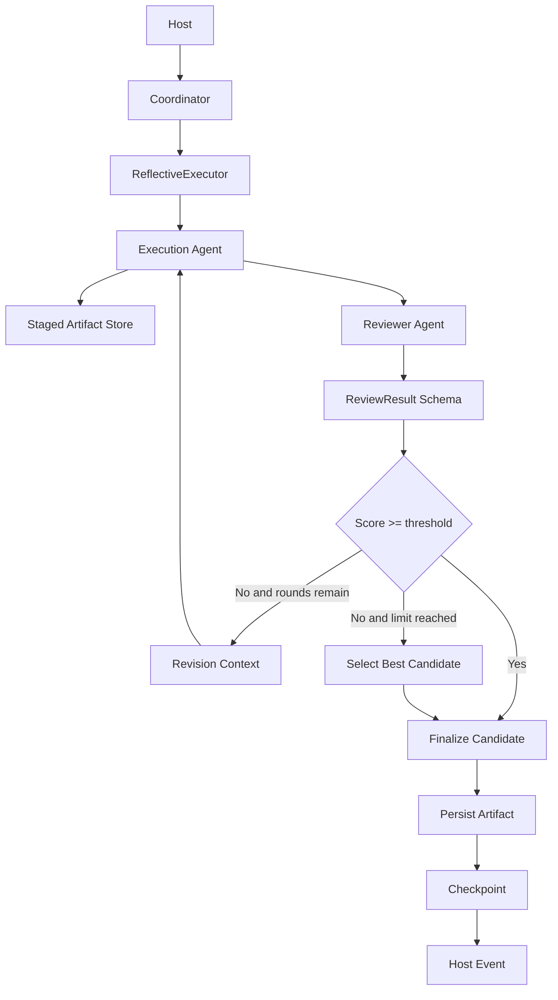

# Agent Reflective Execution

Feature Name: `agent-reflective-execution`
Updated: 2026-07-13

## Description

本设计在现有 Architect、Writer 和 Editor 单次任务外围增加统一的反思执行层。`ReflectiveExecutor` 负责执行候选、调用独立 Reviewer、生成修订上下文、选择最终候选及提交业务工件。每个任务最多执行三轮，默认通过阈值为 85 分。达到轮次上限后，系统返回历史最高分候选并携带结构化质量风险。

现有 Coordinator 编排、Flow Router 决策和 Agent 公共接口保持稳定。反思能力作为 Agent 构建阶段注入的运行时装饰层，不进入 Coordinator 的全局规划职责。

## Architecture



### Boundaries

- `ReflectiveExecutor` 管理单次任务闭环，不负责章节级或全书级规划。
- `ReviewerAgent` 读取任务目标、约束和候选结果，不注册业务工具。
- `StagedArtifactStore` 隔离各轮副作用，仅向正式 Store 提交最终候选。
- Host 继续作为生命周期、预算、事件和恢复的统一入口。

## Components and Interfaces

### ReflectiveExecutor

建议位置：`src/agents/reflection/executor.ts`

```ts
interface ReflectiveTask<TInput, TOutput> {
  agentType: "architect" | "writer" | "editor";
  objective: string;
  constraints: string[];
  input: TInput;
}

interface ReflectiveExecutor {
  execute<TInput, TOutput>(
    task: ReflectiveTask<TInput, TOutput>,
    signal?: AbortSignal,
  ): Promise<ReflectiveResult<TOutput>>;
}
```

执行器依赖 Execution Agent Adapter、Reviewer Agent、Review Rubric Registry、Staged Artifact Store、Budget、Usage Recorder 和 Event Sink。执行器不依赖具体 Agent 内部实现。

### ReviewerAgent

建议位置：`src/agents/reflection/reviewer.ts`

Reviewer 使用 Vercel AI SDK 的结构化输出能力生成 `ReviewResult`。调用输入包含：

- Agent 类型与任务目标
- 明确约束和对应评分量表
- 当前候选结果
- 前序轮次问题及修订摘要

Reviewer 无工具注册，模型配置通过现有 Provider Adapter 和 Model Registry 解析。

### ReviewRubricRegistry

建议位置：`src/agents/reflection/rubrics.ts`

Registry 根据 Agent 类型返回评分维度、权重、阈值和 Reviewer 提示词片段。默认阈值为 85，配置可覆盖阈值。三类默认量表为：

- Architect：结构完整性、因果一致性、角色与世界规则一致性、可执行性
- Writer：任务遵循、情节连贯、角色一致性、文风质量、节奏与可读性
- Editor：问题识别覆盖率、证据准确性、建议可操作性、审阅结论一致性

### StagedArtifactStore

建议位置：`src/store/staging.ts`

每个反思会话使用唯一目录保存候选工件和元数据。正式提交只处理最终候选。提交过程复用现有 Store 原子写入能力，并维持“业务工件写入、checkpoint、事件”顺序。

### Agent Integration

`src/agents/build.ts` 在构建 Architect、Writer 和 Editor 时注入 Reflective Executor。现有 Agent 公共调用签名保持稳定，由 Adapter 将原始执行逻辑包装成候选执行函数。Coordinator 无需感知内部评审轮次，仅接收最终结果及可选 `qualityRisk`。

### Host Integration

Host 接收以下新增事件：

- `reflection.started`
- `review.completed`
- `revision.started`
- `reflection.completed`

Observer 将事件投影到 Headless 和 TUI。Usage 为 Execution Agent 与 Reviewer Agent 分别记录调用来源。

## Data Models

```ts
interface ReviewIssue {
  dimension: string;
  severity: "low" | "medium" | "high";
  evidence: string;
  recommendation: string;
}

interface ReviewResult {
  score: number;
  passed: boolean;
  summary: string;
  issues: ReviewIssue[];
  revisionInstructions: string[];
}

interface ReflectionCandidate<T> {
  round: number;
  output: T;
  review: ReviewResult;
  stagedArtifactIds: string[];
}

interface QualityRisk {
  code: "quality_threshold_unmet" | "budget_exhausted";
  score: number;
  unresolvedIssues: ReviewIssue[];
}

interface ReflectiveResult<T> {
  output: T;
  rounds: number;
  finalReview: ReviewResult;
  qualityRisk?: QualityRisk;
}
```

Zod Schema 对评分使用 `0 <= score <= 100` 约束。`passed` 由运行时根据评分和阈值重新计算，避免模型返回值与分数冲突。

新增配置建议：

```jsonc
{
  "reflection": {
    "enabled": true,
    "max_rounds": 3,
    "pass_threshold": 85,
    "review_retry_limit": 2,
    "reviewer_model": "provider/model"
  }
}
```

旧配置缺少 `reflection` 时使用默认值。`max_rounds` 有效范围为 1 至 3。

## Execution Flow

1. Executor 创建反思会话并发出 `reflection.started`。
2. Execution Agent 基于任务与当前修订上下文生成候选，业务工件进入暂存区。
3. Reviewer 使用对应 Rubric 评审候选。
4. Executor 校验 Reviewer 输出，并根据实际阈值计算 `passed`。
5. Executor 保存候选和评审记录并发出 `review.completed`。
6. 候选通过时立即进入最终提交。
7. 候选未通过且轮次剩余时，Executor 生成包含证据、问题和修订要求的新上下文，发出 `revision.started`。
8. 达到三轮或预算上限时，Executor 按评分最高、同分取最新轮次的规则选择候选。
9. Executor 提交最终候选工件、写入 checkpoint、发出 `reflection.completed`。

## Correctness Properties

1. **Round Bound**: 单个反思会话执行轮数处于 1 至配置上限之间，配置上限不超过 3。
2. **Pass Consistency**: `passed` 等于 `score >= passThreshold`。
3. **Best Candidate Selection**: 未通过时返回最高分候选；同分返回轮次较新的候选。
4. **Side Effect Isolation**: 正式 Store 只接收最终候选对应的业务工件。
5. **Commit Ordering**: 最终提交严格遵循业务工件、checkpoint、事件顺序。
6. **Reviewer Isolation**: Reviewer Agent 无业务工具访问能力。
7. **Recovery Determinism**: 相同 checkpoint 恢复后从已保存轮次继续，不重复提交已完成工件。
8. **Compatibility**: 关闭反思功能时，Agent 执行结果与现有直接执行路径一致。

## Error Handling

- Reviewer Schema 校验失败：在 `review_retry_limit` 范围内重试，仅记录成功评审为候选评审结果。
- Reviewer Provider 失败：使用现有 Provider Failover；重试耗尽后记录诊断信息。
- Execution Agent 失败：沿用现有 Agent 和 Host 错误传播与恢复机制。
- 预算耗尽：从已评审候选中选择最高分结果并添加 `budget_exhausted`；尚无已评审候选时按现有预算错误处理。
- 三轮未通过：返回最佳候选并添加 `quality_threshold_unmet`。
- 暂存提交失败：保留反思会话、候选索引和暂存工件，checkpoint 记录可恢复提交状态。
- 中止信号：停止新调用，保存当前可恢复状态并沿用 Host 的暂停语义。

## Test Strategy

### Unit Tests

- Reflective Executor：首轮通过、第二轮通过、三轮上限、同分选择最新候选。
- Review Schema：边界分数、非法严重程度、缺失证据、`passed` 重算。
- Rubric Registry：三种 Agent 类型映射、默认阈值和配置覆盖。
- Revision Context：问题证据与修订指令完整传递。
- Staged Artifact Store：候选隔离、最终提交和幂等恢复。

### Integration Tests

- Mock Execution Agent 与 Mock Reviewer 完成三轮闭环。
- Reviewer 非法输出触发重试，Provider 故障触发 Failover。
- Budget 在不同轮次耗尽时返回正确候选和风险代码。
- Host 事件顺序及 Execution/Reviewer Usage 分类准确。
- checkpoint 恢复后继续下一轮或完成暂存提交。

### Regression Tests

- 原有 Agent 构建和工具注册测试保持通过。
- Coordinator 和 Flow Router 决策 fixture 保持一致。
- Store 原子写入、checkpoint 和恢复测试保持通过。
- Headless 与 TUI 能处理新增事件类型。
- `pnpm typecheck`、`pnpm test` 和 `pnpm build` 全部通过。

## References

[^1]: `src/agents/build.ts` - 当前 Agent 构建入口。
[^2]: `src/agents/agent.ts` - 当前 Agent 调用抽象。
[^3]: `src/runtime/host.ts` - Host 生命周期与事件入口。
[^4]: `src/runtime/budget.ts` - 预算控制。
[^5]: `src/runtime/usage.ts` - 调用用量记录。
[^6]: `src/store/` - 业务工件与 checkpoint 持久化。
[^7]: `.monkeycode/specs/2026-07-12-nodejs-runtime-migration/design.md` - Node.js 运行时迁移设计。
