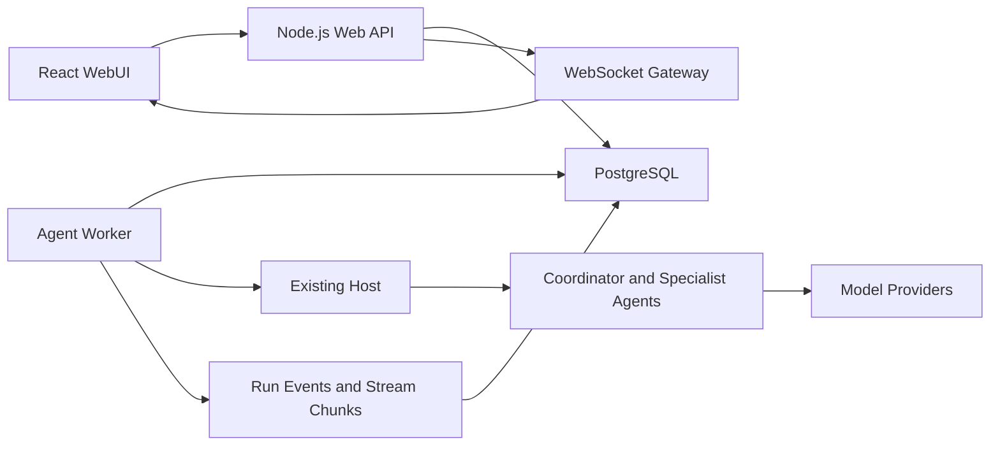

# SynChronicle 多用户 WebUI 技术设计

Feature Name: multi-user-webui
Updated: 2026-07-15

## Description

本设计在现有 CLI/TUI/Headless 架构上增加多用户 Web 平台。平台采用模块化单体 Web 服务、独立 Agent Worker 和 PostgreSQL。WebUI 对齐现有 TUI 功能，并增加账号、作品列表、并发配置、平台模型额度和多用户数据隔离。

首版部署包含三个运行单元：

- Web：认证、REST API、WebSocket、静态前端和管理接口。
- Worker：任务租约、Host 执行、模型调用、恢复和事务提交。
- PostgreSQL：全部业务数据、任务队列、事件和加密凭证。

## Architecture

Web 服务是浏览器唯一入口。REST API 处理资源和命令，WebSocket 处理实时事件。Worker 通过 PostgreSQL 租约队列领取任务，复用现有 Host、Flow Router、Agent、Reviewer、预算和恢复逻辑。

## Components and Interfaces

### Web Frontend

React WebUI 包含：

- 登录页：用户名和密码认证。
- 作品页：创建、列表、归档、导入和导出。
- 创作台：左侧作品结构、中间实时创作流、右侧运行状态。
- 模型设置：用户 Provider 凭证、平台模型和角色模型映射。
- 用量与额度：token、费用、预算、并发和平台额度。
- 移动布局：通过底部导航切换作品、创作流和运行状态。

### Web API

REST 资源按以下边界组织：

- `/api/auth/*`：登录、刷新、退出和修改密码。
- `/api/projects/*`：作品 CRUD、归档、导入和导出。
- `/api/projects/:projectId/runs/*`：启动、暂停、继续、终止和干预。
- `/api/providers/*`：个人凭证、平台模型和角色映射。
- `/api/usage/*`：用量、预算、额度和并发设置。
- `/api/admin/*`：平台模型、用户配额和平台并发上限。

所有 Repository 方法必须接收授权上下文。授权上下文包含 `userId`、角色和请求关联 ID。业务查询在数据库层包含用户范围，避免控制器遗漏隔离条件。

### WebSocket Gateway

浏览器订阅键由 `projectId`、`runId` 和最后事件序号组成。Gateway 校验用户所有权，补发数据库中的缺失事件，再注册实时通知。每个事件包含稳定 ID、单调递增序号、类型、时间和 payload。

### Task Scheduler

任务表同时承担持久化队列职责。Worker 使用条件更新领取可执行任务并写入租约所有者和过期时间。调度查询同时检查：

- 用户运行任务数低于用户并发上限。
- 平台运行任务数低于平台并发上限。
- 目标作品当前不存在运行中的写任务。
- 任务达到计划执行时间且状态允许领取。

Worker 周期性续租。租约过期后，任务进入可恢复状态并由其他 Worker 从最近 checkpoint 继续。

### Agent Worker

Worker 将数据库任务适配为现有 Host 输入，并通过数据库 Store Adapter 替代文件 Store。Host 的事件流、文本流、快照、暂停、恢复、终止和模型切换语义保持稳定。

Worker 进入 durable commit 前响应取消信号。进入 durable commit 后，Worker 完成业务工件、checkpoint、usage 和完成事件的数据库事务，再处理后续取消状态。

### Credential Service

用户模型凭证采用信封加密：服务端主密钥加密数据密钥，数据密钥加密 Provider 凭证。数据库保存密文、算法版本和密钥版本。Worker 仅在发起请求前解密，并在调用完成后释放引用。

平台模型由管理员配置，用户通过额度使用。每次调用记录凭证来源、实际 Provider、实际模型、token、费用和延迟。审计日志不包含凭证明文。

## Data Models

核心表包括：

- `users`：用户名、密码哈希、角色、状态和并发上限。
- `sessions`：刷新会话摘要、到期时间、撤销时间和设备信息。
- `projects`：所有者、标题、状态、版本和归档时间。
- `artifacts`：作品工件类型、JSONB 内容、文本内容、版本和摘要。
- `chapters`：章节序号、标题、正文、状态和版本。
- `runs`：作品、运行状态、最近 checkpoint、预算快照和恢复信息。
- `tasks`：任务类型、状态、优先级、租约、重试和计划时间。
- `run_events`：运行、事件序号、类型、payload 和创建时间。
- `stream_chunks`：运行、序号、Agent、文本片段和创建时间。
- `checkpoints`：运行、版本、状态 JSONB、摘要和提交时间。
- `usage_records`：用户、运行、Agent、Provider、模型、token、费用和延迟。
- `provider_credentials`：用户、Provider、密文、密钥版本和状态。
- `platform_models`：Provider、模型、状态、计价和平台凭证引用。
- `quota_ledger`：用户、额度来源、增减值、余额和关联运行。
- `audit_events`：用户、动作、目标、结果、请求 ID 和时间。

所有用户业务表通过外键关联用户和作品。高频查询索引覆盖任务状态与租约、运行事件序号、作品章节序号、用户用量时间范围和凭证状态。

## Correctness Properties

1. 单个任务在任一时刻最多存在一个有效 Worker 租约。
2. 单个作品在任一时刻最多存在一个运行中的写任务。
3. 每个受保护资源的读写操作关联一个已认证用户。
4. 最终候选提交、checkpoint、usage 和完成事件位于同一数据库事务。
5. 运行事件序号在单个运行范围内单调递增且保持唯一。
6. 用户凭证明文不进入数据库、日志、事件或浏览器响应。
7. 平台额度扣减与平台模型 usage 记录位于同一事务。
8. Worker 恢复仅接受与任务指纹和作品版本一致的 checkpoint。

## Error Handling

- 认证失败返回统一错误，具体原因进入受限审计日志。
- 授权失败返回统一资源访问错误，响应不披露目标资源存在性。
- Worker 崩溃通过租约过期触发恢复；超过重试上限后进入人工处理状态。
- Provider 错误沿用现有 failover；实际响应模型决定 usage 和费用归属。
- 数据库事务失败保留任务可重试状态，事务外不发布完成事件。
- WebSocket 断线保持任务执行；重连根据事件序号补发。
- 凭证解密失败停止对应任务，撤销凭证状态并记录审计事件。
- 配额耗尽在下一次模型调用前停止任务并保存 checkpoint。
- Schema 迁移失败阻止新版本 Worker 启动，Web 服务进入维护状态。

## Security

- 密码使用 Argon2id 和独立随机盐。
- 刷新会话仅保存不可逆摘要，并支持按会话和按用户撤销。
- 修改状态的 HTTP 请求执行来源校验和 CSRF 防护。
- 登录、凭证、任务创建和平台模型接口执行速率限制。
- 用户提供的文件、文本和导出名称执行大小、类型和路径校验。
- API 响应、日志和事件执行凭证字段脱敏。
- 数据库账号按 Web、Worker 和迁移职责分离权限。
- 管理接口要求管理员角色并写入审计事件。

## Deployment

生产环境使用一个 Web 镜像和一个 Worker 镜像，两者可由同一代码仓库和构建产物生成。Web 容器暴露一个 HTTP 端口并托管前端静态资源。Worker 容器不暴露端口。PostgreSQL 使用独立持久化存储。

配置通过面向项目的环境变量注入，至少包含数据库连接、会话签名、凭证主密钥、公共 URL 和 Worker 标识。部署顺序为数据库迁移、Web 滚动更新、Worker 滚动更新。

## Test Strategy

- 单元测试：认证、授权、Repository 范围、加密、配额和状态转换。
- 数据库集成测试：事务提交、任务租约、并发约束、事件序号和 checkpoint 恢复。
- API 集成测试：登录、作品、运行命令、凭证、用量和管理接口。
- WebSocket 测试：授权订阅、实时推送、断线补发、去重和顺序。
- Worker 测试：任务领取、续租、崩溃恢复、暂停、终止、failover 和 durable commit。
- 前端组件测试：创作台、状态面板、提问、模型设置和移动导航。
- 端到端测试：登录、创建作品、启动、实时查看、干预、暂停、恢复和导出。
- 回归测试：保留现有 CLI、TUI、Headless 和 277 项核心测试。

## Delivery Phases

### Phase 1: Platform Foundation

PostgreSQL Schema、认证、授权、作品管理、数据库 Store Adapter、任务租约和基础 WebUI。

### Phase 2: Creative Workbench

实时创作流、TUI 功能对齐、人工干预、暂停恢复、模型设置、导入导出和响应式布局。

### Phase 3: Hybrid Model Operations

用户凭证加密、平台模型、额度台账、并发配置、预算控制和管理接口。

### Phase 4: Production Hardening

水平扩容、备份恢复、审计、速率限制、端到端测试、可观测性和滚动升级。

## References

- `src/tui/events.tsx`：现有 TUI Host 接口、事件 reducer 和 snapshot 数据。
- `src/runtime/host.ts`：运行生命周期、恢复、预算和事件入口。
- `src/runtime/observer.ts`：运行事件和反思事件投影。
- `src/headless/run.ts`：现有无界面事件消费模式。
- `.monkeycode/specs/2026-07-13-agent-reflective-execution/design.md`：反思执行、候选提交和恢复设计。
