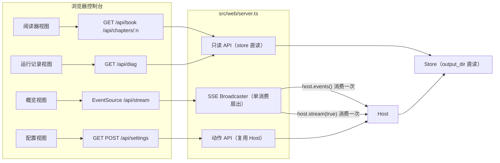

# 控制台质量工作台（阶段一）技术设计

Feature Name: console-quality-workbench
Updated: 2026-09-18

## Description

把 Host/Store/Diag 已有能力接入 Web 控制台：新增只读图书 API、章节详情 API、SSE 广播通道、诊断/导入/导出/配置 API，前端增加阅读器、运行记录、配置三个视图与流式正文面板。全部改动收敛在 `src/web/server.ts` 与 `src/web/app.ts`，运行时层零改动。

## Architecture



关键决策：

1. **只读 API 直读 Store，Host 可缺席**。`RuntimeContext` 在配置加载后即创建 `Store(config.output_dir ?? "output/novel")`，阅读器在创作开始前也能工作；动作 API（run/continue/resume/inject/export/import）仍走 `ensureHost`。
2. **SSE 广播器在服务端单消费、多扇出**。Host 的 `events()`/`stream()` 底层是共享 AsyncQueue，多连接各自消费会互相分抢事件；因此 server 维护一个 Broadcaster，首个订阅者到达时启动消费循环，事件/增量复制给所有连接，心跳每 5 秒附带最新 snapshot。
3. **运行边界用 `RUN_END` 哨兵**。`host.stream(true)` 的边界标记（`\u0000run_end`）原样作为 delta 广播，客户端据此标记"本轮已完成"。
4. **评审数据按章取 `reviews/{NN}.json`**（`src/tools/tools.ts` save_review 落盘），维度分数直接来自 Editor 评审；反思轮次趋势取自运行队列的 reflection 事件。

## Components and Interfaces

### 新增路由（server.ts）

| 路由 | 方法 | 数据源 | 说明 |
|---|---|---|---|
| `/api/book` | GET | progress + layered_outline/outline | 三层树 + 进度 + 字数 + 状态 |
| `/api/chapters/:n` | GET | drafts + summaries + outline + reviews | 章节详情（R2） |
| `/api/stream` | GET | host（可缺席）+ status | SSE：snapshot/runtime/delta |
| `/api/diag` | GET | `diagnose(store)` | stats + findings |
| `/api/export` | POST | `host.export(options)` | txt/epub |
| `/api/import` | POST | `host.importText(path)` | 反推入库 |
| `/api/settings` | GET/POST | loadConfig/saveConfig | 脱敏读 / 核心字段合并写 |

### 章节状态推导

```
completed  ∈ progress.completed_chapters
rewrite    ∈ progress.pending_rewrites
in-progress = progress.in_progress_chapter
pending    其余
```

### Broadcaster（server.ts 内部）

```ts
interface SseClient { send(event: string, data: unknown): void }
// 首个订阅启动：for await host.events() → 广播 "runtime"
//                    for await host.stream(true) → 广播 "delta"
// 心跳 interval 5s → 广播 "snapshot"（含 status() 结果）
// 连接关闭：移除 client；全部离开后停止心跳（消费循环随 host 生命周期存续）
```

### 前端视图切换

导航按钮 `data-view` 驱动，四个 `<section data-page>` 切换 `hidden` 与 `aria-current`。视图：`overview`（现有）/ `reader` / `records` / `settings`。SSE 客户端独立于视图，全局消费：runtime 事件喂概览事件流与记录时间线，delta 喂流式正文面板。

## Data Models

### GET /api/book 响应

```ts
interface BookView {
  novelName: string; phase: string;
  completedChapters: number[]; totalChapters: number;
  totalWordCount: number; pendingRewrites: number[]; inProgressChapter: number;
  volumes: Array<{ index: number; title: string; theme: string;
    arcs: Array<{ index: number; title: string; goal: string; estimatedChapters?: number;
      chapters: Array<{ chapter: number; title: string; status: "completed"|"in-progress"|"pending"|"rewrite"; wordCount: number }> }> }>;
}
```

### GET /api/chapters/:n 响应

```ts
interface ChapterView {
  chapter: number; title: string; status: string; wordCount: number;
  text: string | null; source: "final" | "draft" | null;
  summary: { summary: string; key_events: string[] } | null;
  outlineEntry: { core_event: string; hook?: string } | null;
  review: { verdict: string; summary: string; dimensions: Array<{ dimension: string; score: number; verdict: string; comment?: string }> } | null;
}
```

### GET /api/settings 响应（脱敏）

```ts
interface SettingsView {
  provider: string; model: string; style: string; outputDir: string;
  providers: Record<string, { hasApiKey: boolean; baseUrl?: string }>;
  roles: Record<string, { provider: string; model: string }>;
  budget?: unknown; notify?: unknown; reflection?: unknown;
}
```

## Correctness Properties

1. **只读零副作用**：`/api/book`、`/api/chapters/:n`、`/api/diag`、`GET /api/settings` 只调用 Store 读接口与 diagnose，写操作为零。
2. **事件不丢不抢**：Host 事件/增量由 Broadcaster 单点消费，N 个 SSE 连接各自收到完整副本；SSE 与既有 `/api/status` 轮询可并存。
3. **配置合并保守性**：`POST /api/settings` 仅覆盖请求中出现的核心字段，其余字段从磁盘原值透传；校验失败时不落盘。
4. **向后兼容**：既有 8 条路由的请求/响应契约保持字节级不变；`renderWebApp` 既有测试断言全部保留。
5. **阅读器降级链**：终稿 → 草稿 → `text:null`；分层大纲 → 扁平大纲 → 空树，每级都有明确 UI 态。

## Error Handling

| 场景 | 行为 |
|---|---|
| 未配置时访问只读 API | 200 + `configured:false` + `book:null`（前端渲染引导态） |
| 章节号非法（≤0 / 非整数） | 400 `chapter 必须是正整数` |
| 章节文件缺失 | `text:null` + `status:"pending"`，200 |
| export 无已完成章节 / import 解析失败 | 400 + Host 抛出的原始错误消息 |
| settings 校验失败 | 400 + `validateConfig` 错误消息，磁盘原值 |
| SSE 写入失败（客户端断开） | 移除订阅，静默 |
| diagnose 抛错 | 500 + 错误消息（前端展示重试） |

## Test Strategy

1. **API 单元（web.test.ts 扩展）**：临时目录播种 `progress.json`/`chapters/01.md`/`summaries/01.json`/`reviews/01.json`/`layered_outline.json`，断言 `/api/book` 树结构与状态、`/api/chapters/1` 各字段、非法章节号 400、未配置 200+null。
2. **SSE 冒烟**：连接 `/api/stream`，读取首块断言 `event: snapshot`，随后 abort。
3. **契约回归**：既有 5 个 WebUI 测试全量保留通过；`pnpm typecheck && pnpm test && pnpm build` 全绿。
4. **前端结构断言**：`renderWebApp()` 含 `data-page="reader"`、`EventSource`、`aria-current` 动态切换初始态等标记。

## References

[^1]: (src/runtime/host.ts#L61-L67) — events()/stream()/export/importText 公共接口
[^2]: (src/tools/tools.ts#L164) — save_review 落盘 `reviews/{NN}.json`（维度分数数据源）
[^3]: (src/runtime/stream.ts#L4) — RUN_END 边界哨兵
[^4]: (docs/architecture.md) — 实现状态表与运行中干预说明
