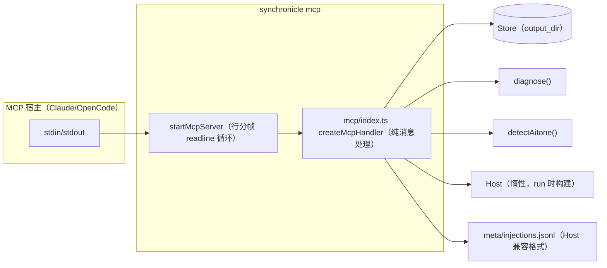

# MCP Server（stdio）技术设计

Feature Name: mcp-server
Updated: 2026-09-18

## Description

零依赖 stdio MCP server：JSON-RPC 2.0 按行分帧，六个工具直连 Store/diagnose/Host（与 Web 控制台同源），`synchronicle mcp` 子命令启动。

## Architecture



## Components and Interfaces

### `src/mcp/index.ts`

```ts
export interface McpOptions { configPath?: string; host?: HostLike; now?: () => Date }
export interface McpMessage { jsonrpc: "2.0"; id?: number | string; method?: string; params?: unknown }
export function createMcpHandler(options: McpOptions): (message: McpMessage) => Promise<unknown | undefined>;
export function startMcpServer(options: McpOptions): Promise<void>;   // readline 逐行 → handler → stdout
```

- handler 返回 undefined 表示通知（无响应）；结果包成 `{ protocolVersion, capabilities, serverInfo }` / `{ tools }` / `{ content: [{ type: "text", text }], isError? }`。
- 工具级错误（章节号非法、未配置、prompt 为空）返回 `isError: true` + 错误消息文本，协议级错误（未知方法）返回 -32601。

### 工具清单

| name | 参数 | 数据源 |
|---|---|---|
| synchronicle_status | — | loadConfig + progress |
| synchronicle_book | — | progress + outline/layered_outline |
| synchronicle_chapter | { chapter: int>0 } | drafts + summaries + reviews + detectAitone |
| synchronicle_diag | — | diagnose(store) |
| synchronicle_run | { prompt: string } | ensureHost → startPrepared/continue（按 runtimeState 分支） |
| synchronicle_inject | { text: string } | FileIO.appendJSONLine("meta/injections.jsonl") |

### CLI 接入（`src/cli/parse.ts` / `dispatch.ts`）

- parse：`mcp` 子命令 → `{ command: "mcp", configPath }`；与 `--headless/--prompt/--prompt-file/--port/--web/version/update` 互斥校验。
- dispatch：`startMcpServer({ configPath })`（异常退出码 1）。

## Correctness Properties

1. **同源事实**：book/chapter/diag 输出与 Web API 同构（同一 Store 读取路径），单机内双入口零分叉。
2. **注入格式兼容**：injections.jsonl 每行 `{text, time}`，Host.consumeInjections 原样消费。
3. **惰性 Host**：Host 仅在 synchronicle_run 首次调用时构建，进程可长期驻留。
4. **零依赖**：不引入 MCP SDK；协议子集（initialize/initialized/ping/tools/list/tools/call）手工实现。

## Error Handling

| 场景 | 行为 |
|---|---|
| 行内 JSON 解析失败 | 跳过该行并 stderr 记录，进程存活 |
| 未知方法（有 id） | -32601 Method not found |
| 工具参数校验失败 | isError 工具结果 + 明确中文错误 |
| 未配置 + 只读工具 | configured:false 空数据 |
| 未配置 + 动作工具 | isError + “先通过 Web 控制台或配置文件准备模型” |
| run 时 Host 构建失败 | isError + 原始错误消息 |

## Test Strategy

1. `src/mcp/mcp.test.ts`：播种临时 Store 后直调 handler——initialize 握手字段、tools/list 六工具、status/book 字段、chapter 含 aitone、非法章节 isError、diag 含 PacingStall、inject 落盘格式、mock host 的 run 分支、未配置分支、未知方法 -32601。
2. `src/cli/parse.test.ts` 增量：`mcp` 解析、`mcp --config x` 通过、`mcp --headless` 互斥报错。
3. 全量 `pnpm typecheck && pnpm test && pnpm build`。

## References

[^1]: (src/web/server.ts) — book/chapter 组装逻辑参照（同源约束）
[^2]: (src/runtime/host.ts#L72-L91) — consumeInjections 的文件格式
[^3]: (https://spec.modelcontextprotocol.io) — stdio 传输与 JSON-RPC 消息形状
