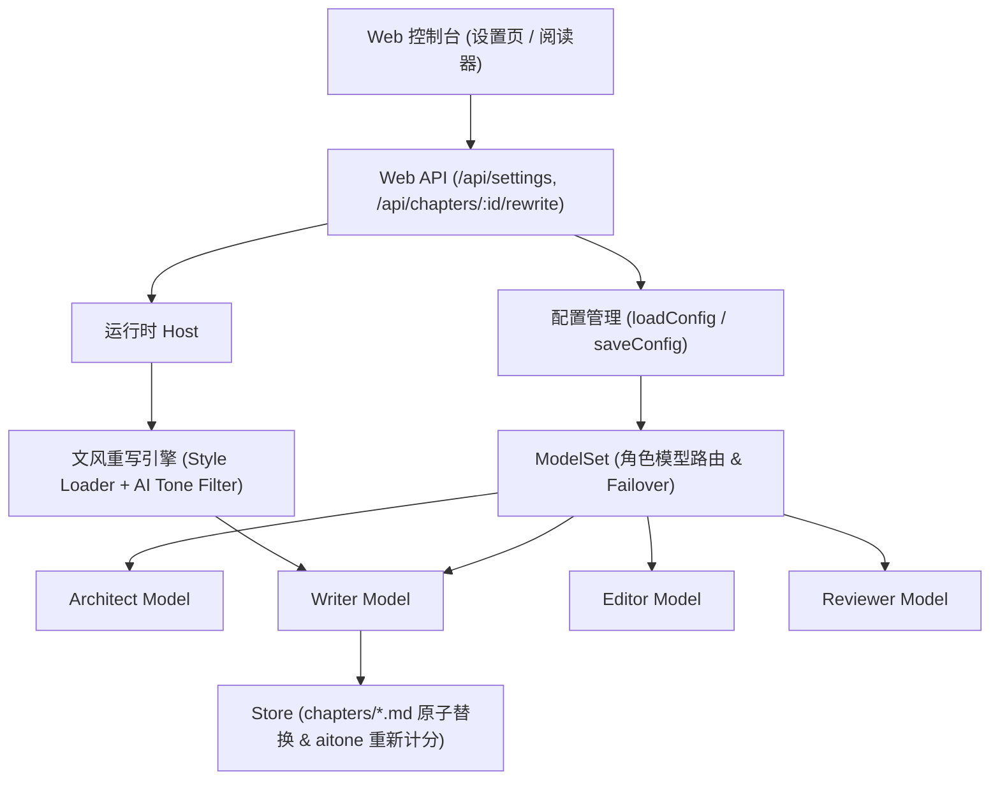

# 多模型协作与章节文风重写技术方案

Feature Name: multi-model-collaboration-and-style-rewrite
Updated: 2026-09-18

## Description

本技术方案旨在完善系统的多模型协作运行机制与文风重构流水线：
1. **多模型协作基础设施**：在配置系统、Web 控制台与运行时之间打通多角色（Coordinator / Architect / Writer / Editor / Reviewer）独立服务商与模型映射，支持界面化配置与实时热更新。
2. **章节文风重写服务**：在后端提供专用章节润色/重写 API，结合 `assets/styles/*.md` 题材资产与 `src/stylestat/aitone.ts` 特征词检测，实现一键消除 AI 味与题材文风定向改造。

## Architecture



## Components and Interfaces

### 1. Web 界面层 (`src/web/app.ts`, `src/web/read.ts`)
- **角色模型配置面板**：增强配置页，提供各角色专属卡片，可分别指定 Provider、Model、Reasoning Effort。
- **阅读器章节重写工具条**：在阅读器文章顶部增加「文风重写 / 降AI味」抽屉或操作弹层，包含风格选择（悬疑/奇幻/言情/默认）及自定义修改诉求。

### 2. 服务端 API (`src/web/server.ts`)
- `POST /api/chapters/:chapter/rewrite`:
  - 请求体：`{ style: string, instructions?: string, reduceAitone?: boolean }`
  - 返回：触发重写任务，支持流式进度或直接返回重写后的候选文本与新评分。
- `POST /api/chapters/:chapter/adopt`:
  - 采纳重写结果写入 `chapters/XX.md` 并更新元数据。

### 3. 文风与去 AI 味处理 (`src/runtime/rewrite.ts`, `src/stylestat/aitone.ts`)
- 将目标章节命中词条（如“仿佛”、“不禁”、“嘴角微微上扬”等）提取为负向负样本；
- 将 `assets/styles/${style}.md` 的句式节奏、感官描写原则注入重写 Prompt；
- 调度 Writer 角色对应的专属模型完成重写，并重算 `detectAitone(newText)`。

## Data Models

```typescript
export interface ChapterRewriteRequest {
  chapter: number;
  style: "default" | "suspense" | "fantasy" | "romance";
  instructions?: string;
  reduceAitone?: boolean;
}

export interface ChapterRewriteResult {
  chapter: number;
  previousText: string;
  rewrittenText: string;
  previousScore: number;
  newScore: number;
  eliminatedHits: string[];
}
```

## Correctness Properties

1. **配置独立性**：修改某一角色的 Provider/Model 绝不破坏其他角色的绑定与默认回退。
2. **幂等与版本安全**：章节重写在未被用户确认采纳前，作为暂存副本保存，不直接覆盖已落盘的章节正文。
3. **数据一致性**：重写采纳后必须联动更新字数统计、大纲进度及 AI 味统计缓存。

## Test Strategy

1. **单元测试**：针对 `aitone` 负向约束生成与风格 Prompt 拼装编写断言。
2. **API 测试**：在 `src/web/web.test.ts` 中增加角色模型提交与章节重写接口的集成测试。
3. **回归验证**：运行 `pnpm typecheck && pnpm test` 保证既有 381 项测试无回归。
