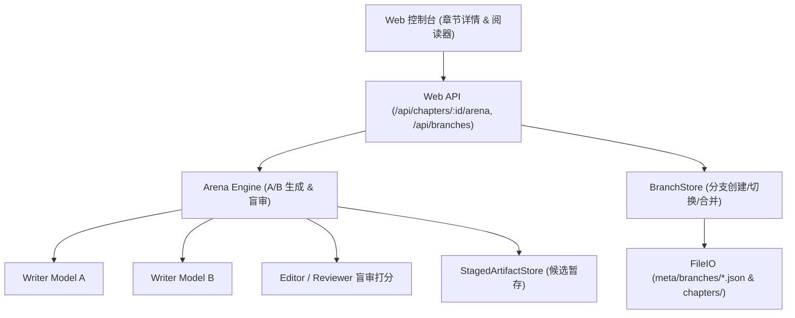

# P3 协同创作与章节 A/B 竞赛技术设计

Feature Name: p3-creative-arena-and-forking
Updated: 2026-09-18

## Description

本设计规划了 Phase 3 的核心组件与接口：
1. **A/B 竞技服务与盲审对比引擎 (`src/runtime/arena.ts`)**：支持双模型并行生成正文候选并自动对比 AI 味与文学质感。
2. **轻量剧情分支管理 (`src/store/branches.ts`)**：提供章节级别分支创建、版本切换与主干原子合并。
3. **Web 端分屏对比与分支看板交互 (`src/web/app.ts`, `src/web/server.ts`)**。

## Architecture



## Data Models

```typescript
export interface ArenaResult {
  chapter: number;
  candidateA: {
    model: string;
    text: string;
    aitoneScore: number;
    wordCount: number;
  };
  candidateB: {
    model: string;
    text: string;
    aitoneScore: number;
    wordCount: number;
  };
  verdict: {
    winner: "A" | "B" | "tie";
    recommendation: string;
    dimensionComparison: Array<{ dimension: string; winner: "A" | "B"; notes: string }>;
  };
}

export interface StoryBranch {
  id: string;
  name: string;
  sourceChapter: number;
  createdAt: string;
  notes?: string;
  active: boolean;
}
```

## Implementation Plan

1. **核心逻辑**：
   - 实现 `src/runtime/arena.ts`（A/B 双模型调度与评分对比）。
   - 实现 `src/store/branches.ts`（分支元数据与分支正文安全存储）。
2. **服务端路由**：
   - `POST /api/chapters/:chapter/arena`：发起竞写并返回对比结果。
   - `GET /api/chapters/:chapter/branches`：获取该章节的分支列表。
   - `POST /api/chapters/:chapter/branches`：创建新分支。
   - `POST /api/chapters/:chapter/branches/checkout`：切换活动分支。
3. **交互与测试**：
   - 编写 `src/runtime/arena.test.ts` 与 `src/store/branches.test.ts`。
   - 界面上提供「A/B 竞写」与「分支演进」轻量触发卡片。
