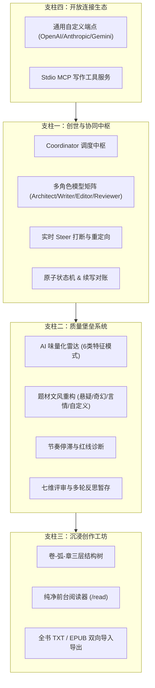
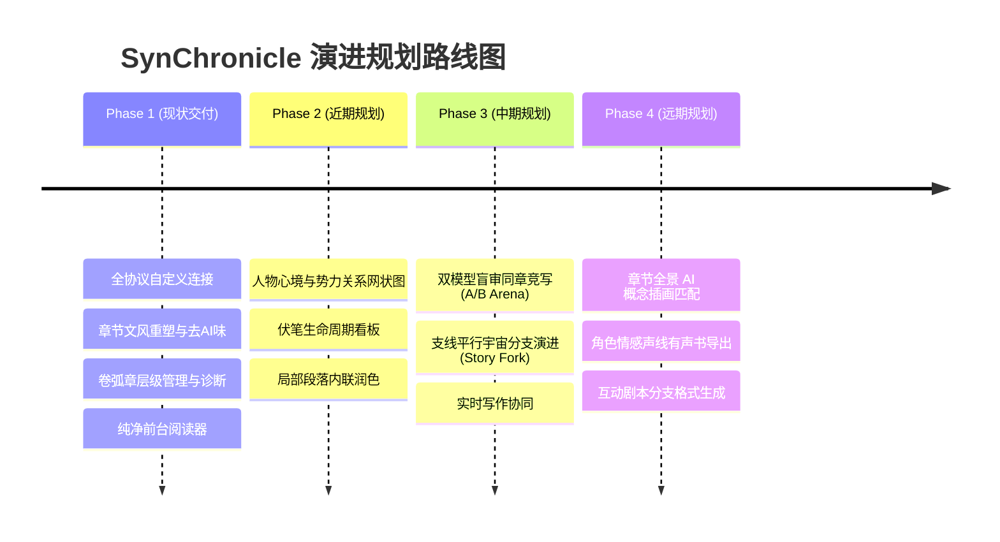

# 产品功能体系重新定义与演进架构设计

Feature Name: product-feature-redefinition-and-roadmap
Updated: 2026-09-18

## Description

本架构设计对 SynChronicle 现有技术栈与能力边界进行全新梳理，将原本分散在 CLI、WebAPI、Agents、Store 与 Eval 的点状功能整合成四个高内聚的核心子系统，并为 Phase 2~Phase 4 的未来能力提供可扩展的接入契约。

## Architecture: 全景功能矩阵重构

## 功能重新定义与聚合 (Feature Matrix Reorganization)

| 原有分散功能点 | 全新所属业务支柱 | 重新定义的核心心智 | 对创作者的直接价值 |
|---|---|---|---|
| `/api/run`, `resume`, `inject` | **支柱一：创世与协同中枢** | **声明式小说生命周期中枢** | 无需关心底层循环，仅凭自然语言诉求推进百万字小说 |
| `/api/settings` 角色分配, `ModelSet` | **支柱一：创世与协同中枢** | **异构模型多工协作矩阵** | 顶层规划用大模型、正文起草用高速模型、评审用强推理模型 |
| `/api/steer`, 打断重写 | **支柱一：创世与协同中枢** | **毫秒级偏航刹车与重定向** | 发现剧情不合心意时，一键物理打断并安全回滚 |
| `src/stylestat/aitone.ts` | **支柱二：质量堡垒系统** | **AI 语调量化雷达** | 实时量化正文套话比例，用明确扣分促进行文去套路化 |
| `src/runtime/rewrite.ts`, `/rewrite` | **支柱二：质量堡垒系统** | **题材文风定向重构工坊** | 针对不同题材注入描写红线，一键消除陈词滥调并原子采纳 |
| `src/diag/`, 节奏红线 | **支柱二：质量堡垒系统** | **小说结构与节奏体检中心** | 自动发现主线拖沓、伏笔未收等全书级暗病 |
| `src/agents/reflection/` | **支柱二：质量堡垒系统** | **七维盲审与多候选暂存池** | 保证章节未通过 85 分门禁前不污染主干，用户可挑选采纳 |
| `/read`, 卷弧章大纲树 | **支柱三：沉浸创作工坊** | **作家级沉浸审阅前台** | 沉浸式阅读与大纲树无缝联动，提供实体书般质感 |
| `/api/export`, `/api/import` | **支柱三：沉浸创作工坊** | **作品全格式出入站口** | 随时离线归档为电子书，或将历史老书导入继续迭代 |
| `/api/config` 协议选择 | **支柱四：开放连接生态** | **零绑定全协议通用连接器** | 支持各类官方直连、OneAPI、反代与本地中转 |
| `src/mcp/` 6个原子工具 | **支柱四：开放连接生态** | **IDE / Agent 原生无缝集成** | 可在 Cursor、Claude Desktop 中直接调度小说大纲与章节 |

---

## 演进规划路线图 (Roadmap 2026-2027)

### 规划技术接入设计

1. **人物心境与实体图谱 (Entity Graph)**:
   - 基于 `store/meta/` 新增 `entities.json`，在 Editor 评审时挂载关系抽取器，输出 Vis.js / D3 兼容的图结构并在 Web 端呈现。
2. **多模型盲审同章竞写 (A/B Arena)**:
   - 在 `runtime/host.ts` 引入 `compete(chapter, models)` 模式，并行派发 2 个 Model 生成候选并交由独立 Reviewer 打盲审对比卡。
3. **多模态视听衍生 (Multimodal)**:
   - 抽象 `MediaAssetStore`，通过标准的文生图 API 将章节的高光场景 prompt 渲染为插画工件，作为附加附件挂载在 `chapters/XX.md` 前置 YAML 元数据中。
