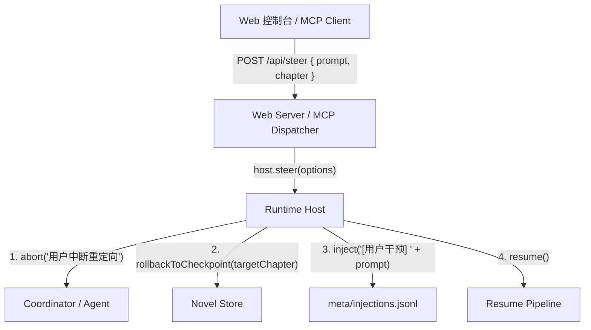

# Technical Design: Prompt Cache & Steer Control

Feature Name: prompt-cache-and-steer
Updated: 2026-09-18

## Description

本方案设计两大核心能力：
1. **Prompt 缓存**：优化 `src/agents/agent.ts` 的 `withCacheBreakpoint` 逻辑，支持 system 首条消息与历史上下文的前缀缓存断点（Anthropic 协议规范）。
2. **Steer 控制流**：在 `Host` 增加原子方法 `steer({ prompt: string; targetChapter?: number })`，协调 `abort`、`store` 状态回滚与带干预文本的 `resume`，并通过 Web API (`POST /api/steer`) 与 MCP 工具 (`synchronicle_steer`) 暴露。

## Architecture



## Components and Interfaces

### 1. `src/agents/agent.ts` 缓存增强
- 在 system / context 中将静态前缀提升，并在 messages 末尾及关键分界点附加 Anthropic `cacheControl: { type: "ephemeral" }`。

### 2. `src/runtime/host.ts` Steer 方法
```typescript
interface SteerOptions {
  prompt: string;
  targetChapter?: number;
}

interface SteerResult {
  aborted: boolean;
  rolledBackToChapter: number;
  label: string | null;
}
```
步骤：
1. 若 `state === "running"`，调用 `abort("用户中断重定向")` 并在短暂挂起后确保释放。
2. 计算目标章节：若未显式指定，查询 `store.progress.load()` 的 `in_progress_chapter` 或最新已提交章节。
3. 清理该章节之后/正在进行的临时草稿 (`drafts/XX.draft.md`, `drafts/XX.plan.json`, `meta/pending_commit.json`)，将 `current_chapter` 调整回目标章节。
4. 写入注入干预：`await this.inject(prompt)`。
5. 异步触发续写：`void this.resume()`。

### 3. Web API 与 MCP 工具
- `POST /api/steer`: 接收 `{ prompt: string, chapter?: number }`，返回 `{ success: true, targetChapter: number }`。
- MCP Server 新增工具 `synchronicle_steer`。

## Correctness Properties
- **原子性与互斥**：Steer 必须串行化，防止与正常 run/resume 发生文件竞态。
- **草稿一致性**：回滚不会破坏已完成历史章节的最终文本，仅清理目标未提交或重写章节。
- **降级保护**：非 Anthropic 模型下 `withCacheBreakpoint` 保持消息原样不变，无额外开销。
