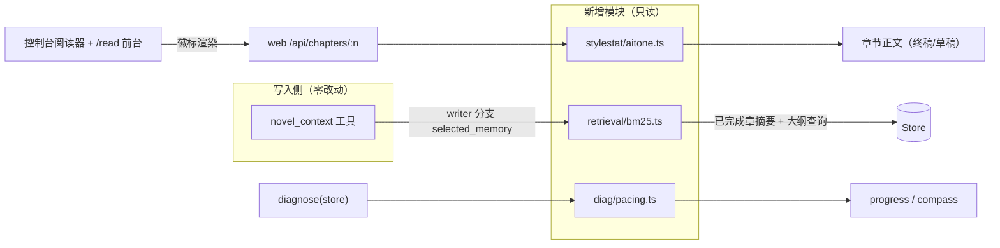

# 质量三件套技术设计

Feature Name: quality-trio
Updated: 2026-09-18

## Description

三个只读旁路的质量能力：BM25 相关章节检索（writer 上下文增强）、AI 味检测（章节 API + 前端徽标）、节奏红线（diag 规则）。运行时写路径零改动。

## Architecture



## Components and Interfaces

### 1. `src/retrieval/bm25.ts`（新，零依赖）

```ts
export function tokenize(text: string): string[];        // CJK bigram + ASCII 词
export interface Bm25Doc { id: number; text: string }
export interface Bm25Hit { id: number; score: number }
export function bm25Search(docs: Bm25Doc[], query: string, k: number): Bm25Hit[];
```

- 参数 k1=1.5、b=0.75；得分按查询词项累加 `IDF × (tf·(k1+1))/(tf + k1·(1-b+b·dl/avgdl))`。
- 纯函数：同输入同输出，可脱离 Store 单测。

### 2. novel_context writer 分支注入（`src/tools/tools.ts`）

- `selected_memory: {}` 改为异步组装：
  - 语料：`summaries/{n}.json` 的 `summary + key_events`（已完成章，排除最近摘要窗口 N=3 章）。
  - 查询：当前章大纲条目 `title + core_event + hook`。
  - `bm25Search(corpus, query, 3)` → `related_chapters: [{chapter, title, summary, score}]`（title 取 outline 条目）。
- 已完成章 < 2 或无大纲条目 → `selected_memory: {}` 保持原样。
- 摘要缺失的章节跳过（语料为空串不入索引）。

### 3. `src/stylestat/aitone.ts`（新）

```ts
export interface AitoneHit { name: string; count: number; samples: string[] }
export interface AitoneResult { score: number; hits: AitoneHit[] }
export function detectAitone(text: string): AitoneResult | null;
```

- 词表（正则，命名与 anti-ai-tone.md 对齐）：量词癖（一丝/一抹/一缕+情绪）、虚词癖（不禁/竟然/不由得/似乎）、明喻套句（如同/宛如/仿佛…一般|似的|一样）、对比定义句式（不是…而是…）、抽象大词（某种程度上/值得注意的是/不知为何/说不清）。
- `score = max(0, 100 - Σ per-1000-字惩罚)`；hits 按 count 降序，samples 取前 2 个匹配片段（截 12 字）。
- text 为空返回 null。

### 4. `/api/chapters/:n` 扩展（`src/web/server.ts`）

- `aitone: text ? detectAitone(text) : null`（detectAitone 为同步纯函数，直接在 handleChapter 调用）。

### 5. 前端徽标（`src/web/app.ts` 阅读器 + `src/web/read.ts` 前台）

- 章节头部 chips 行追加：`AI 味 82`（score ≥ 70 用 warn 色，< 70 中性）；title 属性展示 top 命中模式名与次数。

### 6. `src/diag/pacing.ts`（新）+ diagnose 接入

```ts
export const PACING_LIMITS = { mainlineRun: 5, strandAbsence: 10, overallStall: 15 };
export function pacingFindings(progress: Progress): Finding[];
```

- 主线连续：strand_history 尾部同一值连续长度 > 5 → warning（evidence: `主线『X』已连续 N 章`）。
- 线缺席：history 中出现过的strand，自最后出现位置起缺席 > 10 章且非主线 → warning。
- 整体断档：completed_chapters 数 - strand_history 有效长度 > 15 → warning。
- diagnose() 在现有规则后追加 `findings.push(...pacingFindings(progress))`；history 为空直接返回 []。

## Data Models

```ts
// novel_context writer 响应增量
selected_memory: { related_chapters?: Array<{ chapter: number; title: string; summary: string; score: number }> }
// /api/chapters/:n 响应增量
aitone: { score: number; hits: Array<{ name: string; count: number; samples: string[] }> } | null
```

## Correctness Properties

1. **只读旁路**：三个新模块除组装返回值外零副作用；bm25Search/detectAitone/pacingFindings 均为纯函数。
2. **检索确定性**：相同语料与查询返回相同排序（得分相同按章节号升序破平）。
3. **检测稳定性**：detectAitone 对同一文本输出恒定；空文本/纯空白返回 null。
4. **窗口去重**：related_chapters 与最近 3 章摘要窗口交集为空。
5. **红线只警告**：pacingFindings 只产 warning 级 finding，无 critical。

## Error Handling

| 场景 | 行为 |
|---|---|
| 摘要/大纲缺失 | 跳过该章或整体返回空 selected_memory，novel_context 其余字段正常 |
| 正文为空 | aitone:null，前端隐藏徽标 |
| strand_history 短于阈值 | pacingFindings 返回 [] |
| BM25 语料全空 | bm25Search 返回 [] |

## Test Strategy

1. `src/retrieval/bm25.test.ts`：分词（中英混合）、相关性排序（相关章得分高于无关章）、k 截断、空语料。
2. `src/stylestat/aitone.test.ts`：五类模式各命中一次、得分随密度下降、空文本 null、samples 截断。
3. `src/diag/pacing.test.ts`（并入 diag.test 或独立）：三红线各自触发与各自不触发。
4. `src/tools/tools.test.ts` 增量：writer novel_context 含 related_chapters（播种多章摘要）、章数 < 2 时为空对象。
5. `src/web/web.test.ts` 增量：/api/chapters 响应含 aitone 字段（播种含疲劳词的正文）。

## References

[^1]: (src/tools/tools.ts#L82-L96) — novel_context writer 分支与 selected_memory 占位
[^2]: (assets/references/anti-ai-tone.md#L13-L19) — 词表同源（§二 用词 AI 味）
[^3]: (src/diag/diagnose.ts#L14-L19) — Finding 结构与 severity 约定
[^4]: (src/stylestat/index.ts#L3) — 既有 4 模式 defs，aitone 为独立扩展模块
