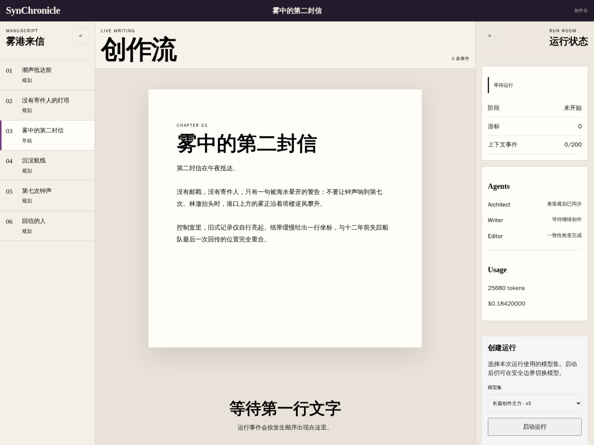
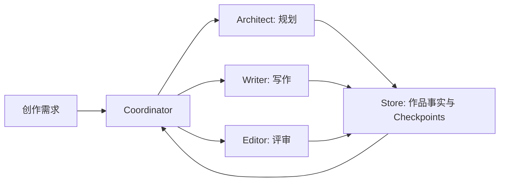
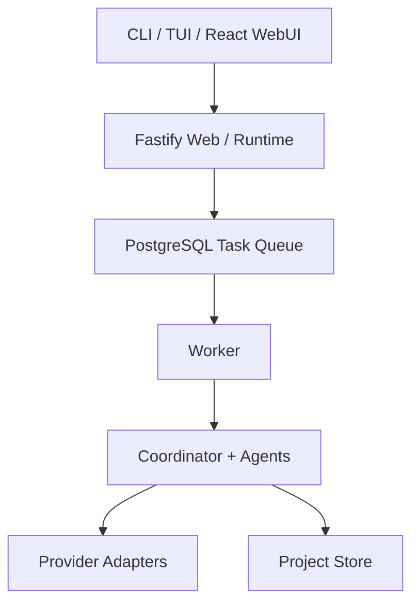

# SynChronicle

<div align="center">

<strong>SynChronicle</strong>

**多智能体 AI 长篇创作引擎，让规划、写作、评审与续写在同一条可恢复的工作流中持续推进。**

[](https://nodejs.org/)
[](LICENSE)

[创作方式](#built-for-long-form-creation) · [五分钟启动](#start-in-five-minutes) · [Web 平台](#web-platform) · [CLI](#cli-workflow) · [开发](#development) · [文档](#documentation)

</div>



## Built For Long-Form Creation

长篇创作需要持续维护故事事实、角色状态、世界规则、章节节奏与伏笔。SynChronicle 将这些工作交给分工明确的 Agent，并把每次关键推进落到可检查的作品文件与 checkpoint 中。

| 能力 | 带来的创作体验 |
| --- | --- |
| 多智能体协作 | Coordinator 统筹规划、写作与评审，减少单轮提示词的职责混杂 |
| 长上下文项目状态 | 卷、弧、章摘要与故事事实持续进入后续创作上下文 |
| 可恢复执行 | 关键步骤写入 checkpoints，回到同一作品目录即可继续 |
| 可观察过程 | TUI 与 WebUI 展示任务进度、Agent 活动和运行状态 |
| 模型配置 | 支持 OpenAI、Anthropic、Google 及兼容接口的项目级配置 |
| 多用户 WebUI | Web、Worker 与 PostgreSQL 组成可部署的协作平台 |

作品从一句需求开始，逐步形成前提、大纲、角色档案、世界规则、章节正文、摘要与评审记录。创作者可以随时阅读这些工件，理解当前进展并继续干预。

## One Story, Four Specialized Agents



| 角色 | 核心职责 |
| --- | --- |
| Coordinator | 决定下一步行动，组织 Agent 协作并推进完整创作循环 |
| Architect | 维护故事前提、分层大纲、角色、世界规则与滚动规划 |
| Writer | 加载上下文、规划章节、生成草稿、检查一致性并提交终稿 |
| Editor | 在弧与卷边界评审结构、一致性、节奏和审美质量 |

Store 连接所有角色，持久化正文、元数据、摘要、状态、评审与 checkpoints，让创作过程持续积累、可追踪、可恢复。

## Start In Five Minutes

需要 [Node.js 24 或更高版本](https://nodejs.org/) 以及一个由你管理的模型服务 API Key。

### 1. 从源码构建并启动

```bash
git clone https://github.com/one-ea/SynChronicle.git
cd SynChronicle
corepack enable
pnpm install --frozen-lockfile
pnpm build
node dist/cli/index.js
```

首次运行会引导创建 `~/.synchronicle/config.json`。也可以提前写入最小配置：

```jsonc
{
  "provider": "openrouter",
  "model": "google/gemini-2.5-flash",
  "providers": {
    "openrouter": {
      "type": "openai",
      "api_key": "your-api-key",
      "base_url": "https://openrouter.ai/api/v1"
    }
  }
}
```

### 2. 从一句需求开始

```bash
node dist/cli/index.js --headless --prompt "写一本发生在海上空间站的悬疑长篇"
```

每本作品绑定启动目录。再次进入同一目录运行 `node /path/to/SynChronicle/dist/cli/index.js`，系统会读取最近 checkpoint 并继续推进。

## Web Platform

容器化平台由四个 Compose 服务组成：`postgres` 保存平台数据，`migrate` 执行数据库迁移，`web` 提供静态页面、API 与 WebSocket，`worker` 异步执行创作任务。

```bash
cp .env.web.example .env.web
ENV_FILE=.env.web docker compose config
ENV_FILE=.env.web docker compose up -d --build
```

将 `.env.web` 中的全部占位值替换为部署环境自己的配置。默认 Web 地址为 `http://127.0.0.1:3000`。

```bash
curl --fail http://127.0.0.1:3000/api/health/live
curl --fail http://127.0.0.1:3000/api/health/ready
```

`web` 是唯一公开入口；PostgreSQL 与 Worker 保留在内部 Compose 网络。备份、恢复、密钥轮换、Worker 扩容与故障处理见[容器部署手册](docs/operations/container-deployment.md)。

## CLI Workflow

在作品目录中运行交互式 TUI：

```bash
node /path/to/SynChronicle/dist/cli/index.js
```

使用 headless 模式接入脚本或自动化流程：

```bash
node /path/to/SynChronicle/dist/cli/index.js --headless --prompt "写一本发生在海上空间站的悬疑长篇"
node /path/to/SynChronicle/dist/cli/index.js --headless --prompt-file prompt.txt
node /path/to/SynChronicle/dist/cli/index.js --config ./config.json
```

全局配置位于 `~/.synchronicle/config.json`，项目配置位于 `./.synchronicle/config.json`，命令行 `--config` 可以指定独立配置文件。项目配置会覆盖对应的全局设置。

## Your Work Stays Inspectable

创作数据默认写入当前目录的 `output/novel/`：

```text
output/novel/
|-- premise.md
|-- outline.json
|-- layered_outline.json
|-- characters.json
|-- world_rules.json
|-- chapters/
|-- summaries/
|-- drafts/
|-- reviews/
`-- meta/
```

正文、规划、摘要和评审使用可直接阅读的文件保存，`meta/` 记录运行状态与 checkpoints。备份整个作品目录即可保留创作内容和恢复状态。

## Architecture



SynChronicle 使用 TypeScript 构建 CLI、TUI 和服务端运行时，React 提供 WebUI，Fastify 提供 Web/API/WebSocket 入口，Worker 执行后台任务，PostgreSQL 与 Drizzle 管理多用户平台数据。Provider adapters 将 Agent 执行连接到不同模型服务。

深入了解[运行时架构](docs/architecture.md)、[上下文管理](docs/context-management.md)与[可观测性](docs/observability.md)。

## Development

仓库使用 pnpm 10 与 Node.js 24：

```bash
corepack enable
pnpm install --frozen-lockfile
pnpm typecheck
pnpm test
pnpm build
pnpm test:browser
```

`pnpm typecheck` 执行 TypeScript 静态检查，`pnpm test` 运行 Vitest，`pnpm build` 构建 CLI 与 WebUI，`pnpm test:browser` 运行 Playwright 浏览器测试。

## Documentation

- [架构概览](docs/architecture.md)
- [上下文管理](docs/context-management.md)
- [可观测性](docs/observability.md)
- [评测体系](docs/evaluation-system.md)
- [用户规则运行时](docs/user-rules-runtime.md)
- [提示词缓存设计](docs/prompt-cache-design.md)
- [容器部署手册](docs/operations/container-deployment.md)

问题与改进建议可通过 [GitHub Issues](https://github.com/one-ea/SynChronicle/issues) 提交。

## Security

- API Key 使用 `your-api-key` 之类的占位符记录在示例中，真实凭据由用户自己的配置或部署密钥系统管理。
- 共享日志、配置、提示词或作品内容前，检查其中的凭据与敏感信息。
- Web 平台提供来源校验、请求限流、安全响应头、管理接口 RBAC 与加密凭据存储。
- 使用第三方模型服务时，确认其数据处理和保留策略符合你的要求。

安全相关问题请通过 [GitHub Security Advisory](https://github.com/one-ea/SynChronicle/security/advisories/new) 私密报告，避免在公开 Issue 中披露凭据或可利用细节。

## License

SynChronicle 以 [GNU General Public License v3.0](LICENSE) 发布，SPDX 标识为 `GPL-3.0-only`。

Copyright 2026 one-ea

第三方声明与版权信息见 [NOTICE](NOTICE)。
