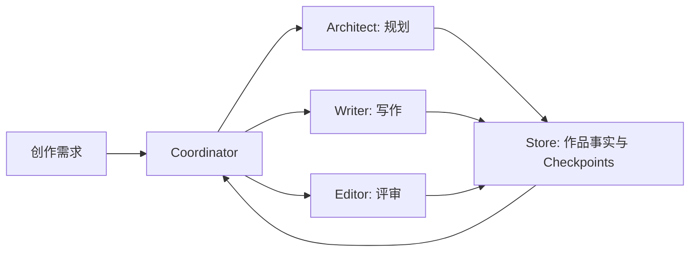

# README Editorial Redesign Implementation Plan

> **For agentic workers:** REQUIRED SUB-SKILL: Use superpowers:subagent-driven-development (recommended) or superpowers:executing-plans to implement this plan task-by-task. Steps use checkbox (`- [ ]`) syntax for tracking.

**Goal:** Replace the repository README with a concise editorial product homepage and add a real WebUI workbench screenshot.

**Architecture:** Keep the change documentation-only. Capture the existing demo WebUI with Playwright, rewrite `README.md` from verified repository facts, and validate commands, links, image metadata, package branding, build output, and Markdown whitespace before pushing.

**Tech Stack:** GitHub Markdown, Mermaid, Playwright, Node.js 24, pnpm 10, TypeScript, Fastify, React, PostgreSQL, Drizzle ORM

## Global Constraints

- Keep the README between 180 and 230 lines.
- Use `# SynChronicle` and position the product as a multi-agent AI long-form writing engine.
- Require Node.js 24 or later and use pnpm for repository development commands.
- Describe only behavior supported by current code, tests, configuration, or operational documentation.
- Use placeholders for provider credentials and never expose local or platform credentials.
- Keep Mermaid labels on one line and quote labels containing special characters.
- Preserve `GPL-3.0-only`, copyright 2026 one-ea, and links to `LICENSE` and `NOTICE`.
- Do not modify product source code.
- Leave `.superpowers/brainstorm/` untracked and untouched.

---

### Task 1: Capture The Real WebUI Workbench

**Files:**
- Create: `docs/assets/webui-workbench.png`

**Interfaces:**
- Consumes: running demo WebUI at the current preview URL, credentials `demo` / `demo`, Playwright Chromium
- Produces: a 1440px-wide PNG referenced by `README.md`

- [ ] **Step 1: Verify the current preview responds**

Run:

```bash
curl --fail --silent --show-error --max-time 10 https://5173-d0d19cba6cc31e88.monkeycode-ai.online/login >/dev/null
```

Expected: exit status 0.

- [ ] **Step 2: Verify the screenshot destination directory exists**

Run:

```bash
ls docs
```

Expected: the `docs` directory is listed successfully. Create `docs/assets` with `mkdir -p docs/assets` only when absent.

- [ ] **Step 3: Capture the authenticated workbench**

Run a bounded Playwright script from the repository root:

```bash
node --input-type=module -e 'import { chromium } from "playwright"; const browser = await chromium.launch({ headless: true }); const page = await browser.newPage({ viewport: { width: 1440, height: 1000 }, deviceScaleFactor: 1 }); await page.goto("https://5173-d0d19cba6cc31e88.monkeycode-ai.online/login", { waitUntil: "networkidle" }); await page.getByLabel("用户名").fill("demo"); await page.getByLabel("密码").fill("demo"); await page.getByRole("button", { name: "登录", exact: true }).click(); await page.waitForLoadState("networkidle"); const firstProject = page.locator("a[href^=\"/projects/\"]").first(); if (await firstProject.count()) { await firstProject.click(); await page.waitForLoadState("networkidle"); } await page.screenshot({ path: "docs/assets/webui-workbench.png", fullPage: false }); await browser.close();'
```

Expected: `docs/assets/webui-workbench.png` is created from the authenticated application.

- [ ] **Step 4: Validate the PNG**

Run:

```bash
file docs/assets/webui-workbench.png
```

Expected: output identifies a PNG image with width 1440 and contains no error.

- [ ] **Step 5: Commit the screenshot**

```bash
git add docs/assets/webui-workbench.png
git commit -m "docs(readme): add WebUI workbench preview"
```

### Task 2: Rewrite README As An Editorial Product Homepage

**Files:**
- Modify: `README.md`
- Reference: `package.json`
- Reference: `compose.yaml`
- Reference: `docs/operations/container-deployment.md`
- Reference: `docs/superpowers/specs/2026-07-22-readme-editorial-redesign.md`

**Interfaces:**
- Consumes: `docs/assets/webui-workbench.png`, package scripts, Compose service names, documented health endpoints
- Produces: a 180-230 line GitHub README with valid navigation, commands, Mermaid, and repository links

- [ ] **Step 1: Replace the README structure**

Use `apply_patch` to rewrite `README.md` with these exact top-level sections in order:

```markdown
# SynChronicle
## Built For Long-Form Creation
## One Story, Four Specialized Agents
## Start In Five Minutes
## Web Platform
## CLI Workflow
## Your Work Stays Inspectable
## Architecture
## Development
## Documentation
## Security
## License
```

The hero must include a centered title block, one-sentence Chinese positioning, Node.js/npm/license badges, compact anchor navigation, and `docs/assets/webui-workbench.png` immediately after the hero.

- [ ] **Step 2: Add the product workflow diagram**

Use this Mermaid structure with single-line quoted labels:



- [ ] **Step 3: Keep commands aligned with repository behavior**

Include these verified command groups:

```bash
npm install -g synchronicle
synchronicle
synchronicle --headless --prompt "写一本发生在海上空间站的悬疑长篇"
```

```bash
corepack enable
pnpm install --frozen-lockfile
pnpm typecheck
pnpm test
pnpm build
pnpm test:browser
```

```bash
cp .env.web.example .env.web
ENV_FILE=.env.web docker compose config
ENV_FILE=.env.web docker compose up -d --build
```

The minimal configuration must use `your-api-key` and contain no real credential.

- [ ] **Step 4: Validate length, stale paths, and repository links**

Run:

```bash
wc -l README.md
rg -n "internal/|\.go\b|scripts/sample\.gif|scripts/novel\.png|TODO|TBD" README.md
```

Expected: line count is 180-230; `rg` returns no matches.

Run a Node script that extracts Markdown links with relative targets, removes anchors, and verifies every target exists with `fs.existsSync`.

Expected: exit status 0 and no missing path output.

- [ ] **Step 5: Run focused branding verification**

Run:

```bash
pnpm vitest run src/brand/brand.test.ts
git diff --check
```

Expected: brand tests pass and `git diff --check` prints no output.

- [ ] **Step 6: Commit the README**

```bash
git add README.md
git commit -m "docs(readme): present SynChronicle as an editorial product homepage"
```

### Task 3: Verify And Publish The Documentation Change

**Files:**
- Verify: `README.md`
- Verify: `docs/assets/webui-workbench.png`
- Verify: `docs/superpowers/specs/2026-07-22-readme-editorial-redesign.md`
- Verify: `docs/superpowers/plans/2026-07-22-readme-editorial-redesign.md`

**Interfaces:**
- Consumes: completed screenshot and README commits
- Produces: a clean feature branch synchronized with `origin/260715-feat-multi-user-webui`

- [ ] **Step 1: Run the repository verification gate**

Run independently:

```bash
pnpm typecheck
pnpm build
pnpm vitest run src/brand/brand.test.ts
git diff --check
```

Expected: every command exits 0.

- [ ] **Step 2: Inspect the final change set**

Run:

```bash
git status --short --branch
git diff origin/260715-feat-multi-user-webui...HEAD --stat
git log --oneline -10
```

Expected: only approved README design, plan, screenshot, and README commits are ahead; `.superpowers/brainstorm/` remains untracked.

- [ ] **Step 3: Push the feature branch**

Run:

```bash
git push origin 260715-feat-multi-user-webui
```

Expected: remote branch advances to the final documentation commit.

- [ ] **Step 4: Confirm synchronization**

Run:

```bash
git status --short --branch
```

Expected: `260715-feat-multi-user-webui...origin/260715-feat-multi-user-webui` with only `.superpowers/brainstorm/` listed as untracked.
